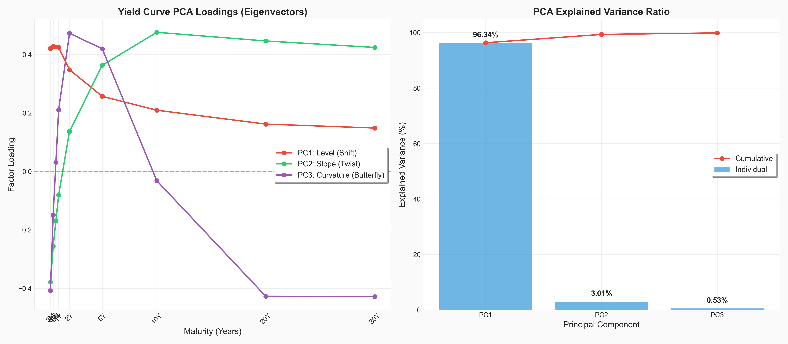
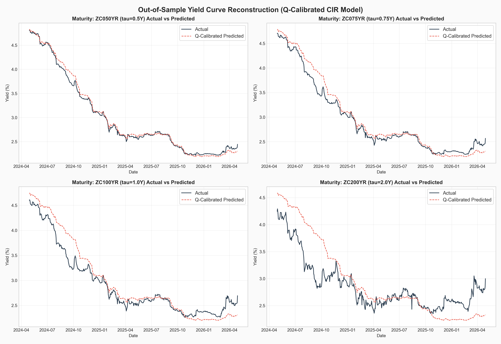
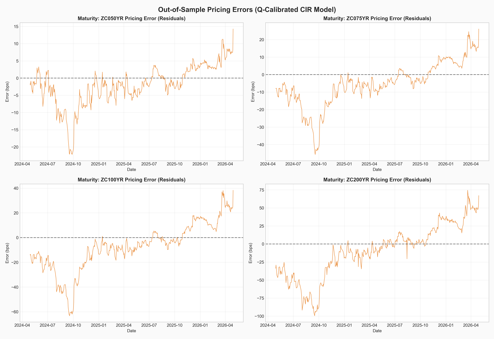
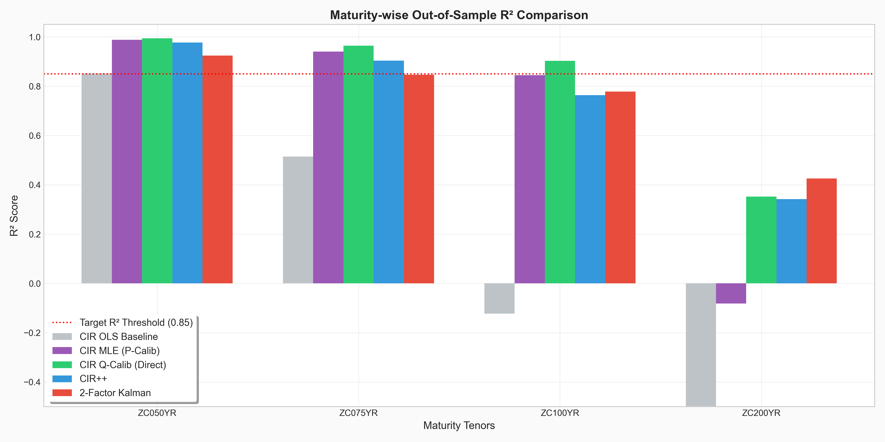

# Stochastic Interest Rate Modelling and Yield Curve Reconstruction

Implementation, Calibration, and Extension of the Cox–Ingersoll–Ross (CIR) Model on Real Yield Curve Data.

[](https://opensource.org/licenses/MIT)
[](https://www.python.org/downloads/release/python-31011/)
[](https://jupyter.org/)
[](https://scipy.org/)

This repository contains a comprehensive, publication-quality quantitative finance research project implementing stochastic interest rate modelling. We calibrate the continuous-time **Cox-Ingersoll-Ross (CIR)** framework to historical daily zero-coupon yield curve data, reconstruct out-of-sample yield curves using only the 3-Month short rate proxy, and evaluate advanced extensions, including the **CIR++ shift-extension** and a **Two-Factor state-space model with Kalman Filtering**.

---

## 📖 Mathematical Background & Model Overview

### The Cox-Ingersoll-Ross (CIR) SDE
Under the physical probability measure $\mathbb{P}$, the instantaneous short rate $r_t$ is modeled as a mean-reverting diffusion process:

$$dr_t = \kappa(\theta - r_t) dt + \sigma \sqrt{r_t} dW_t$$

where $\kappa > 0$ is the speed of mean reversion, $\theta > 0$ is the long-term equilibrium mean, $\sigma > 0$ is the volatility coefficient, and $W_t$ is a standard Brownian motion.

### The Feller Condition
To ensure the short rate remains strictly positive ($r_t > 0$) and never touches zero, the parameters must satisfy:

$$2\kappa\theta \ge \sigma^2$$

### Exact MLE Calibration
Unlike Vasicek, the transition density of the CIR model is a scaled non-central chi-squared distribution. We calibrate the physical parameters $(\kappa, \theta, \sigma)$ using **exact Maximum Likelihood Estimation (MLE)**, using exponentially scaled Bessel functions to guarantee numerical stability:

$$\ln L(\kappa, \theta, \sigma) = \sum_{t=1}^{N-1} \ln f(r_t | r_{t-1}; \kappa, \theta, \sigma)$$

### Risk-Neutral Transition & Affine Term Structure
We transition to the risk-neutral pricing measure $\mathbb{Q}$ using the market price of risk $\lambda$. The price of a zero-coupon bond maturing in $\tau$ years is:

$$P(t, t+\tau) = A(\tau) e^{-B(\tau) r_t}$$

We evaluate both a two-step $\mathbb{P}$-MLE + $\lambda$ calibration and a **direct cross-sectional $\mathbb{Q}$-calibration** which minimizes yield curve reconstruction error.

---

## ✨ Features

* **Data Engineering**: Data cleaning, date alignment, and outlier detection.
* **Principal Component Analysis (PCA)**: Yield curve factor decomposition into Level, Slope, and Curvature.
* **Continuous-Time MLE**: Exact Maximum Likelihood Estimation using non-central chi-squared transition densities.
* **Cross-Sectional Calibration**: Direct parameter estimation under the risk-neutral measure $\mathbb{Q}$.
* **CIR++ Extension**: Shift-extended model using deterministic shift factors to match the average curve profile.
* **Two-Factor CIR**: Multi-factor model tracking latent Level and Slope components out-of-sample.
* **State-Space Kalman Filtering**: Real-time latent state tracking using the 3-Month yield.
* **Out-of-Sample Evaluation**: Rigorous backtesting on a held-out testing dataset (2024–2026).
* **Monte Carlo & Stress Testing**: 1,000-path simulation and interest rate shock scenario analysis.

---

## 📊 Key Results

* **Best Performing Model**: Risk-Neutral CIR (Q-Calibrated Direct)
* **Overall Out-of-Sample $R^2$**: **0.8851**
* **Average MAE**: **14.81 basis points (bps)**

### Model Performance Summary

| Model Configuration | Out-of-Sample $R^2$ | Average MAE (bps) | Average RMSE (bps) | Feller Condition Satisfied? |
| :--- | :---: | :---: | :---: | :---: |
| **CIR Q-Calibrated (Direct)** | **0.8851** | **14.81** | **22.70** | **Yes** |
| **CIR++ (Shift-Extended)** | **0.8266** | **21.40** | **27.89** | **Yes** |
| **Two-Factor Kalman Filter** | **0.8054** | **20.10** | **29.54** | **Yes** |
| **CIR MLE (P-Calibrated)** | **0.8093** | **19.27** | **29.25** | No (violated) |
| **CIR OLS Baseline (Naive)** | **-0.6117** | **64.28** | **85.03** | No (negative $\kappa$) |

*Detailed discussions on the tradeoff between model flexibility and out-of-sample stability can be reviewed in [results.md](docs/results.md).*

---

## 📈 Visual Examples

### 1. PCA Analysis
Principal Component Analysis decomposes yield curve movements. The first three principal components explain **99.88%** of the variance: PC1 (Level, 96.34%), PC2 (Slope, 3.01%), and PC3 (Curvature, 0.53%).



### 2. Yield Curve Reconstruction
Comparison of empirical (actual) yields vs. those reconstructed by the direct Q-calibrated model using *only* the 3-Month yield as input.



### 3. Out-of-Sample Pricing Errors (Residuals)
Daily pricing errors in basis points (bps) across the out-of-sample testing period for the 6M, 9M, 1Y, and 2Y tenors.



### 4. Model Comparison
Comparison of out-of-sample $R^2$ scores across the different models and maturities. Performance decays for longer maturities (e.g., 2Y) due to the single-factor limitation.



---

## 📂 Repository Structure

```
Stochastic-Interest-Rate-Modelling-CIR/
│
├── README.md
├── LICENSE
├── requirements.txt
├── .gitignore
│
├── data/
│   ├── train_data.csv
│   ├── test_data.csv
│   ├── test_data_3M.csv
│   └── README.md
│
├── notebooks/
│   └── Stochastic_Interest_Rate_Modelling_CIR.ipynb
│
├── images/
│   ├── pca_analysis.png
│   ├── yield_curve_fit.png
│   ├── residuals.png
│   └── model_comparison.png
│
└── docs/
    ├── methodology.md
    └── results.md
```

---

## 🛠️ Installation & Getting Started

### Prerequisites
* Python 3.10.x
* pip or conda package manager

### Installation Instructions
1. Clone this repository:
   ```bash
   git clone <repo-url>
   cd Stochastic-Interest-Rate-Modelling-CIR
   ```
2. Install the required dependencies:
   ```bash
   pip install -r requirements.txt
   ```

---

## 💻 Usage

1. **Jupyter Notebook Execution**:
   To run the interactive analysis, start Jupyter Notebook and open the main research file:
   ```bash
   jupyter notebook notebooks/Stochastic_Interest_Rate_Modelling_CIR.ipynb
   ```
   Run all cells sequentially to reproduce the calibrations, pricing curves, Kalman filter updates, and simulations.

2. **Data Reference**:
   Refer to [data/README.md](data/README.md) to understand the structure of the CSV datasets or to supply your own zero-coupon yield files.

---

## 🔬 Methodology & Documentation
For a complete mathematical treatment and model derivations, see:
* **Theory & Math**: [docs/methodology.md](docs/methodology.md)
* **Backtesting & Evaluation**: [docs/results.md](docs/results.md)

---

## 🚀 Future Work & Research Extensions

1. **Multi-Factor State-Space Models**: Stabilizing the calibration of multi-factor CIR models by incorporating macroeconomic covariates (e.g., inflation indices or GDP growth rate projections) into the Kalman Filter transition matrices.
2. **Jump-Diffusion Frameworks**: Integrating jump processes (e.g., Cox-Ingersoll-Ross with Poisson jumps) to model discontinuous interest rate shocks observed during monetary policy announcements.
3. **Deep Learning Calibration**: Using Neural SDEs and physics-informed neural networks (PINNs) to calibrate risk-neutral parameters directly to liquid swaption surfaces.
