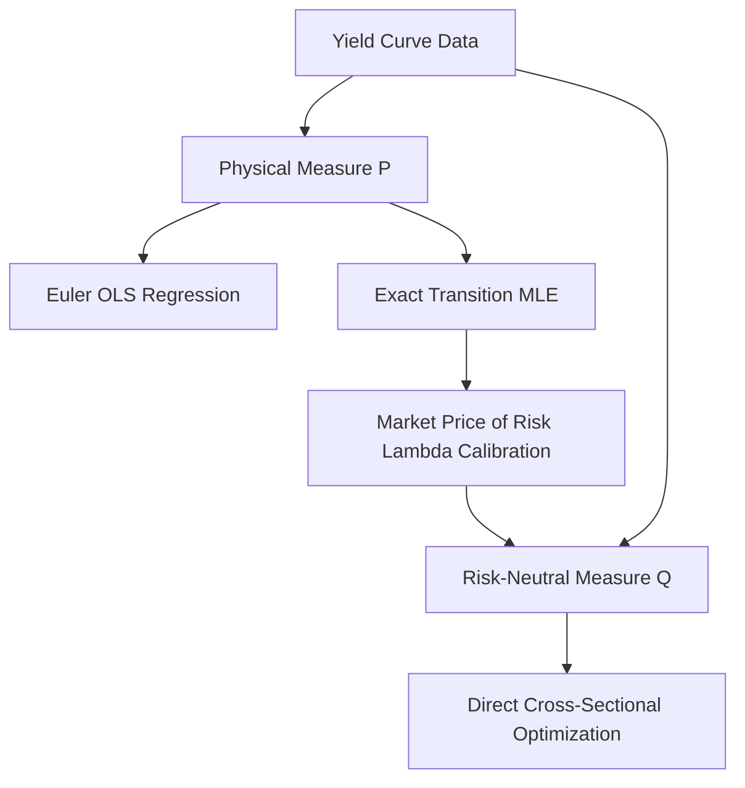

# Quantitative Methodology: Cox-Ingersoll-Ross (CIR) Interest Rate Modelling

This document details the mathematical framework, calibration techniques, and advanced extensions implemented in this project for stochastic interest rate modelling and yield curve reconstruction.

---

## 1. Mathematical Foundations of the Cox-Ingersoll-Ross (CIR) Model

The Cox-Ingersoll-Ross (1985) model is a single-factor, short-rate model widely used in quantitative finance for derivative pricing, risk management, and term structure simulations. 

### 1.1 The Stochastic Differential Equation (SDE)
Under the physical probability measure $\mathbb{P}$, the instantaneous short rate $r_t$ evolves according to the following Stochastic Differential Equation:

$$dr_t = \kappa(\theta - r_t) dt + \sigma \sqrt{r_t} dW_t$$

Where:
* **$r_t$**: The instantaneous short rate at time $t$. In practice, the 3-Month zero-coupon yield is used as a proxy.
* **$\kappa > 0$**: The speed of mean reversion. It determines how quickly the rate returns to its long-term average. The half-life of a shock is defined as $t_{1/2} = \ln(2)/\kappa$.
* **$\theta > 0$**: The long-term mean or equilibrium level of the short rate.
* **$\sigma > 0$**: The volatility coefficient. The local variance of changes in the short rate is $\sigma^2 r_t$, meaning volatility scales with the level of the interest rate (preventing absolute volatility from remaining constant when rates are low).
* **$W_t$**: A standard 1-dimensional Brownian motion under $\mathbb{P}$.

### 1.2 The Feller Condition
Because of the square-root term $\sqrt{r_t}$ in the diffusion coefficient, if $r_t$ reaches zero, the diffusion vanishes and the positive drift term $\kappa\theta dt$ pulls the rate back toward the positive territory. To mathematically guarantee that the short rate remains strictly positive ($r_t > 0$) for all $t > 0$, the parameters must satisfy the **Feller Condition**:

$$2\kappa\theta \ge \sigma^2$$

If the Feller condition holds, the boundary $0$ is inaccessible. If it is violated, the rate can touch $0$ but will reflect back immediately. In empirical applications using daily data, low-interest environments and high volatility often lead to violations of this condition under physical measure calibrations, requiring numerical floors (e.g., $r_t = \max(r_t, 10^{-6})$) in practical simulations.

### 1.3 Exact Transition Density and Maximum Likelihood Estimation (MLE)
Unlike Gaussian short-rate models (e.g., Vasicek), the CIR model does not possess a normal transition distribution. Given the short rate $r_s$ at a prior time $s < t$, the transition probability density function of $r_t$ under the continuous-time process is based on a scaled non-central chi-squared distribution:

$$f(r_t | r_s; \kappa, \theta, \sigma) = c e^{-u - v} \left( \frac{v}{u} \right)^{\frac{q}{2}} I_q(2 \sqrt{u v})$$

Where:
* $\Delta t = t - s$
* $c = \frac{2\kappa}{\sigma^2 (1 - e^{-\kappa \Delta t})}$
* $u = c r_s e^{-\kappa \Delta t}$
* $v = c r_t$
* $q = \frac{2\kappa\theta}{\sigma^2} - 1$
* $I_q(\cdot)$ is the modified Bessel function of the first kind of order $q$.

#### Numerical Stability in MLE Calibration
For daily data ($\Delta t = 1/252$), the arguments to the Bessel function can become extremely large, leading to floating-point overflow. To solve this, we implement the exponentially scaled modified Bessel function:

$$\text{ive}(q, z) = I_q(z) e^{-z}$$

Using this scaling, the log-likelihood for a time series of short rates $\{r_1, r_2, \dots, r_N\}$ is computed stably as:

$$\ln L(\kappa, \theta, \sigma) = \sum_{t=1}^{N-1} \left[ \ln c - (\sqrt{u_t} - \sqrt{v_{t+1}})^2 + \frac{q}{2}\ln\left(\frac{v_{t+1}}{u_t}\right) + \ln \text{ive}\left(q, 2\sqrt{u_t v_{t+1}}\right) \right]$$

---

## 2. Zero-Coupon Bond Pricing & Measure Transition

To price fixed-income securities and reconstruct the yield curve, we must transition from the physical measure $\mathbb{P}$ (historical dynamics) to the risk-neutral pricing measure $\mathbb{Q}$.

### 2.1 The Risk-Neutral Measure $\mathbb{Q}$
We assume a linear market price of interest rate risk $\lambda$, which adjusts the drift of the short rate:

$$dr_t = \left[ \kappa\theta - (\kappa + \lambda)r_t \right] dt + \sigma \sqrt{r_t} dW_t^\mathbb{Q}$$

We define the risk-neutral parameters:
* **$\kappa^\mathbb{Q} = \kappa + \lambda$**: The risk-neutral speed of mean reversion.
* **$\theta^\mathbb{Q} = \frac{\kappa\theta}{\kappa + \lambda}$**: The risk-neutral long-term mean.

### 2.2 Analytical Pricing Formula
Under the risk-neutral measure, the price at time $t$ of a zero-coupon bond maturing at $T$ (with time-to-maturity $\tau = T - t$) is given by the analytical affine term structure formula:

$$P(t, T) = A(\tau) e^{-B(\tau) r_t}$$

Where:
* $h = \sqrt{(\kappa^\mathbb{Q})^2 + 2\sigma^2}$
* $A(\tau) = \left[ \frac{2 h e^{(\kappa^\mathbb{Q} + h)\tau / 2}}{2h + (\kappa^\mathbb{Q} + h)(e^{h\tau} - 1)} \right]^{\frac{2\kappa^\mathbb{Q}\theta^\mathbb{Q}}{\sigma^2}}$
* $B(\tau) = \frac{2(e^{h\tau} - 1)}{2h + (\kappa^\mathbb{Q} + h)(e^{h\tau} - 1)}$

The continuously compounded yield $y(t, \tau)$ for maturity $\tau$ is:

$$y(t, \tau) = -\frac{\ln P(t, T)}{\tau} = \frac{B(\tau) r_t - \ln A(\tau)}{\tau}$$

---

## 3. Calibration Methodologies

We compare four distinct calibration configurations across the physical and risk-neutral measures.

### 3.1 Euler-Maruyama Discretized OLS (Naive Baseline)
The Euler discretization of the CIR SDE is:
$$r_{t+1} - r_t = \kappa(\theta - r_t)\Delta t + \sigma\sqrt{r_t}\sqrt{\Delta t}\epsilon_{t+1}$$

To stabilize the error variance, we divide by $\sqrt{r_t}$:
$$\frac{r_{t+1} - r_t}{\sqrt{r_t}} = \frac{\kappa\theta\Delta t}{\sqrt{r_t}} - \kappa\sqrt{r_t}\Delta t + \sigma\sqrt{\Delta t}\epsilon_{t+1}$$

This is estimated as a linear regression without an intercept: $Y_{t+1} = \beta_1 X_{1,t} + \beta_2 X_{2,t} + \eta_{t+1}$.
* **Limitation**: Unconstrained OLS does not enforce positivity constraints. In trending environments, OLS can result in invalid negative parameters ($\kappa < 0$ or $\theta < 0$), causing model explosion or undefined square-root diffusion terms.

### 3.2 Exact transition MLE
We maximize the exact transition log-likelihood $\ln L(\kappa, \theta, \sigma)$ subject to strict positivity bounds using the L-BFGS-B optimization algorithm:
* $\kappa \in [10^{-4}, 5.0]$
* $\theta \in [10^{-4}, 0.1]$
* $\sigma \in [10^{-4}, 0.3]$

### 3.3 Market Price of Risk ($\lambda$) Calibration
Using the physical MLE parameters, we calibrate $\lambda$ to bridge to the risk-neutral measure by minimizing the Mean Squared Error (MSE) of reconstructed yields over the training dataset:

$$\min_{\lambda} \frac{1}{N \cdot M} \sum_{t=1}^N \sum_{j=1}^M \left( y_{\text{observed}}(t, \tau_j) - y_{\text{CIR}}(r_t, \tau_j; \kappa + \lambda, \theta^\mathbb{Q}, \sigma) \right)^2$$

### 3.4 Direct Q-Measure Cross-Sectional Optimization
Rather than calibrating in two steps ($\mathbb{P}$-MLE then $\lambda$), we calibrate the parameters directly under the risk-neutral measure by fitting the entire yield curve cross-sectionally. We solve:

$$\min_{\kappa_q, \theta_q, \sigma_q} \frac{1}{N \cdot M} \sum_{t=1}^N \sum_{j=1}^M \left( y_{\text{observed}}(t, \tau_j) - y_{\text{CIR}}(r_t, \tau_j; \kappa_q, \theta_q, \sigma_q) \right)^2$$

This method focuses on minimizing yield reconstruction errors directly, resulting in stable and highly accurate predictions.

---

## 4. Principal Component Analysis (PCA)

Principal Component Analysis (PCA) decomposes empirical yield curve changes into orthogonal factors. The yield $y(t, \tau)$ is modeled as:

$$y(t, \tau) = \bar{y}(\tau) + \sum_{i=1}^3 L_i(\tau) P_i(t) + \epsilon_t(\tau)$$

Where:
* $\bar{y}(\tau)$ is the mean yield for maturity $\tau$.
* $P_i(t)$ is the $i$-th principal component score at time $t$.
* $L_i(\tau)$ is the loading vector (eigenvector) for factor $i$.

The first three components have distinct financial interpretations:
1. **Level ($P_1$)**: Flat loading vector across maturities. A shock shifts the entire yield curve.
2. **Slope ($P_2$)**: Monotonic, cross-zero loading vector. Tweaks the steepness of the curve.
3. **Curvature ($P_3$)**: Humped loading vector. Modifies the curvature (butterfly spread).

---

## 5. Model Extensions

### 5.1 The Shift-Extended CIR++ Model
The single-factor CIR model maps the short rate to a specific yield curve, meaning it cannot fit arbitrary initial yield curves. The CIR++ model (Brigo & Mercurio) resolves this by adding a deterministic shift function $\varphi(t)$:

$$r_t = x_t + \varphi(t)$$

Where $x_t$ is a standard CIR process. The yield for maturity $\tau$ is shifted by:

$$y(t, \tau) = y_{\text{CIR}}(x_t, \tau) + \Phi(\tau)$$

We calibrate $\Phi(\tau)$ to the average residual pricing error on the training set:

$$\Phi(\tau) = \frac{1}{N} \sum_{t=1}^N \left( y_{\text{observed}}(t, \tau) - y_{\text{CIR}}(r_t, \tau) \right)$$

### 5.2 Two-Factor CIR Model with Kalman Filtering
To capture independent movements in level and slope, we model the short rate as the sum of two independent processes:

$$r_t = x_t + y_t$$

Where:
* $dx_t = \kappa_x(\theta_x - x_t) dt + \sigma_x \sqrt{x_t} dW_{1,t}^\mathbb{Q}$
* $dy_t = \kappa_y(\theta_y - y_t) dt + \sigma_y \sqrt{y_t} dW_{2,t}^\mathbb{Q}$

The zero-coupon yield in the two-factor model is:

$$y(t, \tau) = \frac{B_x(\tau) x_t + B_y(\tau) y_t - \ln A_x(\tau) - \ln A_y(\tau)}{\tau}$$

#### State Space Representation and Kalman Filter
We represent the dynamics in state-space form:
* **Transition Equation**:
  $$\begin{bmatrix} x_t \\ y_t \end{bmatrix} = \begin{bmatrix} 1 - \kappa_x dt & 0 \\ 0 & 1 - \kappa_y dt \end{bmatrix} \begin{bmatrix} x_{t-1} \\ y_{t-1} \end{bmatrix} + \begin{bmatrix} \kappa_x \theta_x dt \\ \kappa_y \theta_y dt \end{bmatrix} + \eta_t$$
  Where the covariance of $\eta_t$ is $Q_t = \text{diag}(\sigma_x^2 x_{t-1} dt, \sigma_y^2 y_{t-1} dt)$.
* **Measurement Equation** (Observing only the 3M short rate proxy):
  $$z_t = \begin{bmatrix} \frac{B_x(0.25)}{0.25} & \frac{B_y(0.25)}{0.25} \end{bmatrix} \begin{bmatrix} x_t \\ y_t \end{bmatrix} - \frac{\ln A_x(0.25) + \ln A_y(0.25)}{0.25} + v_t$$

The Kalman Filter recursively estimates the latent state vector $X_t = [x_t, y_t]^T$ on the test set, updating predictions based on the 3M yield.
